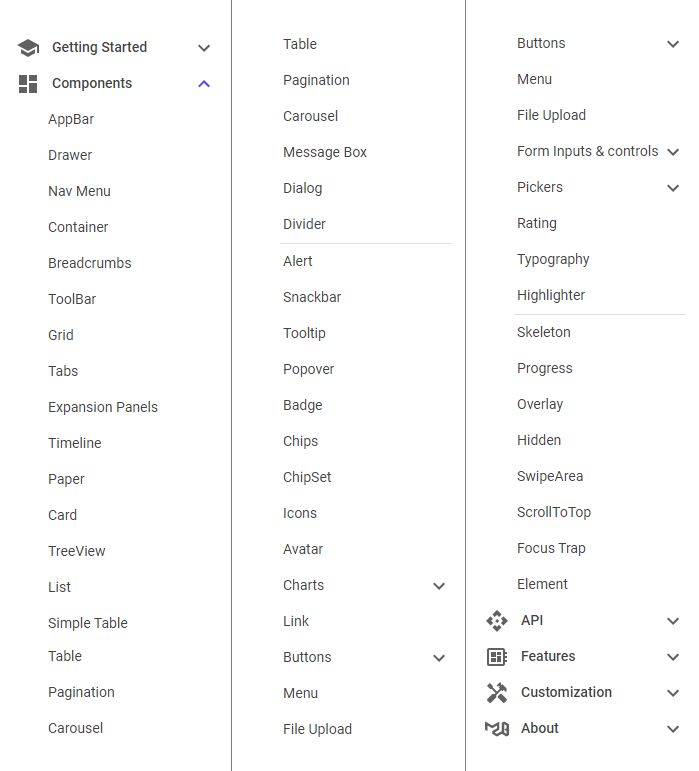

# MudBlazor-documentation-order

A [Tampermonkey](https://tampermonkey.net/) script that groups and reorders components in the [MudBlazor documentation](https://mudblazor.com/components/) menu according to their meaning. Currently there are three groups: *Containers*, *Non-containers*, and *Utilities*. If you want, you can change the grouping and sort order by editing the `menuOrder` table in the script. See description in the script for more information.

The following screenshot shows the default grouping and order:

Tested in Google Chrome 93 on Windows 10.
